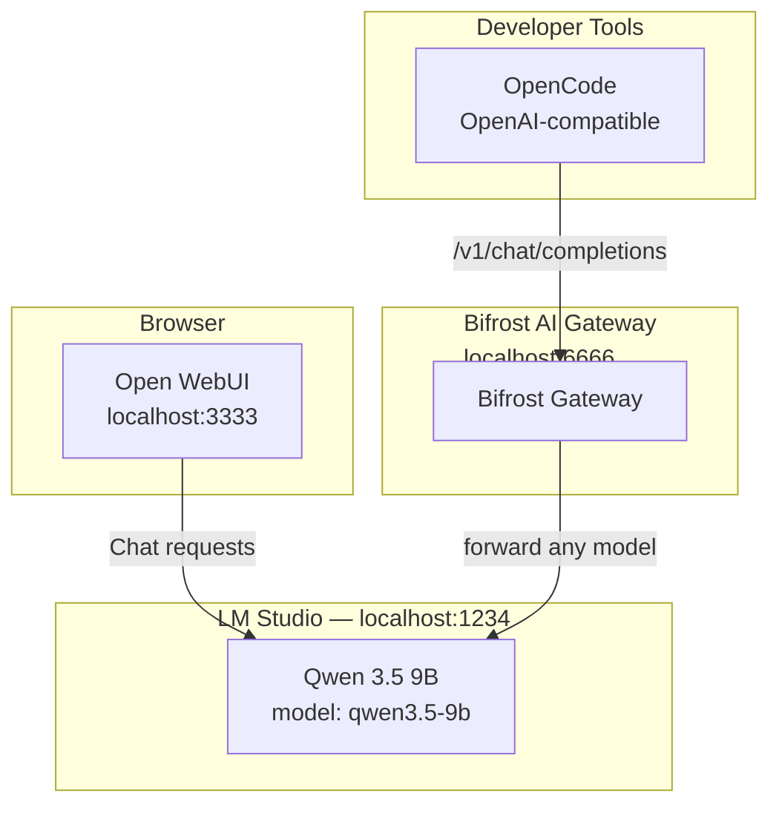

# Architecture

## Overview

ModelDoki provides a complete local AI workstation on macOS. All services run natively on Apple Silicon, managed by `launchd` instead of Docker.

## System Diagram

## Component Descriptions

### LM Studio

- Native macOS application for running local LLMs
- Exposes **one** OpenAI-compatible endpoint on port 1234
- Loads a single model: Qwen 3.5 9B MLX (identifier `qwen3.5-9b`)
- MLX format is Apple Silicon native — optimized for M-series Neural Engine and GPU
- The API accepts any `model` value — the loaded model answers all requests

### Open WebUI

- Feature-rich chat interface
- Connects directly to the LM Studio endpoint (port 1234)
- Runs natively via Python (uv/pip) — no Docker required
- Provides: conversation management, markdown rendering, code highlighting

### Bifrost AI Gateway

- High-performance AI gateway powered by [Bifrost](https://github.com/maximhq/bifrost)
- Exposes an OpenAI-compatible API at port 6666 with a web UI dashboard
- Routes all requests to LM Studio (port 1234) with automatic failover,
  load balancing, and semantic caching
- Web dashboard at `http://localhost:6666/` for real-time monitoring

### OpenCode

- CLI coding assistant
- Connects to the Bifrost endpoint at port 6666 (or directly to LM Studio
  at port 1234) with model `qwen3.5-9b`
- Uses the OpenAI-compatible `/v1/chat/completions` API

## Data Flow

1. **Chat/UI flow**: Browser → Open WebUI (3333) → LM Studio (1234) → Qwen 3.5 9B
2. **Coding flow**: OpenCode → Bifrost (6666) → LM Studio (1234) → Qwen 3.5 9B
3. **Gateway flow**: Any client → Bifrost (6666) → LM Studio (1234) → Qwen 3.5 9B

## Process Management

All services (except LM Studio) are managed by `launchd`:

- `com.modeldoki.openwebui` — Open WebUI server
- `com.modeldoki.bifrost` — Bifrost gateway

LM Studio is managed via its GUI or CLI (`~/.lmstudio/bin/lms`).
