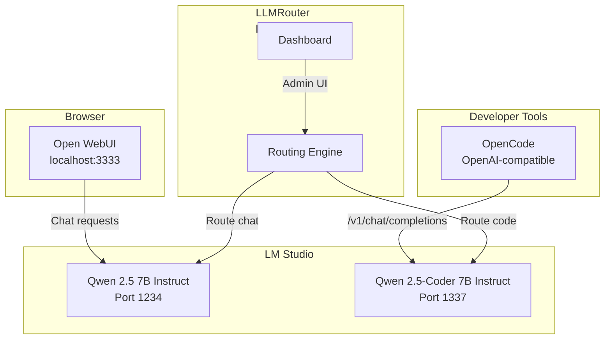

# Architecture

## Overview

ModelDoki provides a complete local AI workstation on macOS. All services run natively on Apple Silicon, managed by `launchd` instead of Docker.

## System Diagram

## Component Descriptions

### LM Studio
- Native macOS application for running local LLMs
- Exposes two OpenAI-compatible endpoints:
  - Port 1234: Qwen 2.5 7B Instruct (chat/general)
  - Port 1337: Qwen 2.5-Coder 7B Instruct (coding)
- GPU acceleration via Metal on Apple Silicon

### Open WebUI
- Feature-rich chat interface
- Connects to LM Studio chat endpoint (port 1234)
- Runs natively via Python (uv/pip) — no Docker required
- Provides: conversation management, markdown rendering, code highlighting

### LLMRouter
- Smart request router between model endpoints
- Exposes OpenAI-compatible API at port 6666
- Routes based on model name prefix:
  - `qwen2.5-7b-instruct*` → chat port 1234
  - `qwen2.5-coder-7b-instruct*` → coder port 1337
- Provides admin dashboard at port 6666

### OpenCode
- CLI coding assistant
- Connects directly to LM Studio coder endpoint at port 1337
- Uses OpenAI-compatible `/v1/chat/completions` API

## Data Flow

1. **Chat flow**: Browser → Open WebUI (3333) → LM Studio Chat (1234) → Qwen 2.5 7B
2. **Coding flow**: OpenCode → LM Studio Coder (1337) → Qwen 2.5-Coder 7B
3. **Routed flow**: Any client → LLMRouter (6666) → routing rules → appropriate model

## Process Management

All services (except LM Studio) are managed by `launchd`:
- `com.modeldoki.openwebui` — Open WebUI server
- `com.modeldoki.llmrouter` — LLMRouter server

LM Studio is managed via its GUI or CLI (`~/.lmstudio/bin/lmstudio`).
